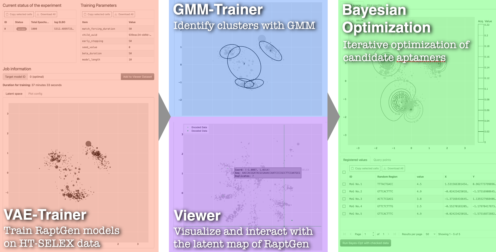

<div align="center">
   <br>
   The GUI for RaptGen developed with React and FastAPI
</div>

## What is RaptGen-UI?

RaptGen-UI is a web-based user-friendly interface for RaptGen, a powerful Latent Space Bayesian Optimization (LSBO) method for identifying and optimizing aptamers from high-throughput SELEX data. For more information about RaptGen or RaptGen-UI, please refer to the [RaptGen paper](https://doi.org/10.1038/s43588-022-00249-6) or [RaptGen-UI paper](https://doi.org/10.1038/s43588-023-00331-4), respectively.

## Overview

<p align="center">
   <br>
</p>

Currently, RaptGen-UI supports four modules: Viewer, VAE Trainer, GMM Trainer, and Bayesian Optimization.
Users first need to upload their data and then run VAE Trainer module. After that, users can inquire the latent space of the uploaded data by Viewer module, or run GMM Trainer module to get clustering results. Finally, users can use Bayesian Optimization module to optimize aptamers.

For more information about its usage, please read the [documentation](https://unkosan.github.io/RaptGen-UI/).

## How to Launch

Git clone this repository.

```shell
$ git clone https://github.com/Unkosan/RaptGen-UI.git
$ cd RaptGen-UI
```

And just run the following command inside the directory!

```shell
$ docker compose up -d
```

After waiting for a while, you can access the RaptGen-UI by going to http://localhost:18042.

This application is deployed on Docker compose. Detailed procedure can be found in the [documentation](https://unkosan.github.io/RaptGen-UI/setup.md). Let's check it out!

## Contributing

Contributions are welcome! Please feel free to open an issue or submit a pull request.

<!-- Just make sure to follow the [Code of Conduct](CODE_OF_CONDUCT.md). -->

## Citation

If you use RaptGen-UI in your research, please cite the following paper:

```bibtex
@article{nakano2025raptgenui,
   title={RaptGen-UI: Interactive Interface for RNA Aptamer Identification Using Latent Space Bayesian Optimization}
   author={Nakano, Ryota and Iwano, Natsuki and Ichinose, Akiko and Hamada, Michiaki}
   year={2025},
}
```

## License

This project is licensed under the [MIT License](LICENSE).
You are free to use, modify, and distribute this software for personal or commercial purposes.
