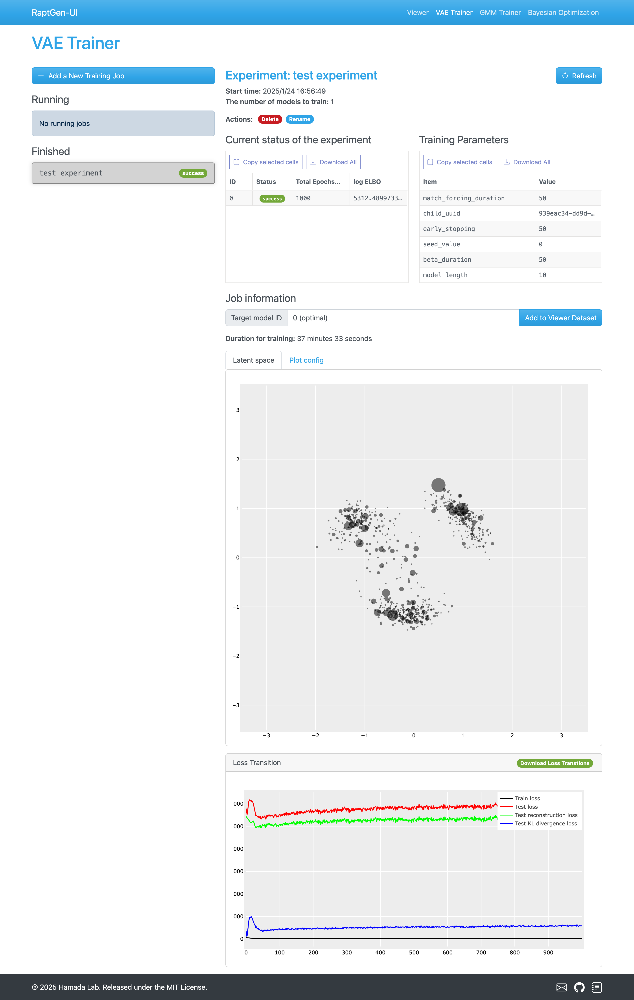
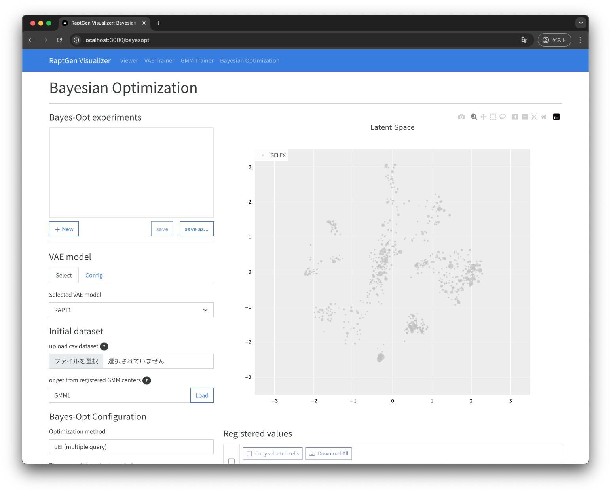

<p align="center">
   <br>
   The GUI for RaptGen developed with React and FastAPI
</p>

## How to Launch

### Preliminaries

Please check if the Docker is installed. like

```shell
$ docker -v
Docker version 20.10.21, build baeda1f
```

### Procedure

1. Open your terminal. If you would like to run this application on a remote server, use SSH with port-forwarding.
   ```shell
   $ ssh -L 18042:localhost:18042 username@hostname.com
   ```
   Otherwise, skip this step.
2. Clone this repository wherever you want, then go into `RaptGen-UI` directory.
   ```shell
   $ git clone https://github.com/hmdlab/RaptGen-UI.git
   $ cd RaptGen-UI
   ```
3. Export your UID and GID environmental variables with the following command (needed for the `worker` container to work successfully.)
   ```shell
   $ export UID GID
   ```
4. Build and run containers with docker-compose. If you have GPU devices which supports CUDA, run with `docker-compose.gpu.yml` file.
   ```shell
   $ docker compose -f docker-compose.gpu.yml up -d
   ```
   Otherwise, you need to assign `docker-compose.prod.yml` file.
   ```shell
   $ docker compose -f docker-compose.prod.yml up -d
   ```
5. Please wait before all the containers are ready. This may take a few minutes. Even if Docker says they are ready, it may take some extra time for the `frontend` container to be working.
6. Access http://localhost:18042 with your favorite internet browser.
7. If you would like to stop the containers, please type the following command. This stops containers and all data will be retained in `db` container.
   ```shell
   $ docker compose stop
   ```
   If you send `down` command, all data will be lost (containers are removed.)

## Usage

For now, four application is available. They are `Viewer`, `VAE Trainer`, `GMM Trainer`, and `Bayesian Optimization`. For more information, please refer to the following links.

### [Viewer](docs/Viewer.md)

Visualize the latent map of the HT-SELEX data.

You can encode a single nucleotide sequence or batch sequences from fasta file. However decoding from a batch coordinates file is not supported.
Downloading is also supported. You can select which cluster to download.


### [VAE Trainer](docs/VAE_Trainer.md)

Train a VAE model on HT-SELEX data.



### [GMM Trainer](docs/GMM_Trainer.md)

Train a GMM model on latent space of HT-SELEX data.


### [Bayesian Optimization](docs/BO.md)

Optimize aptamers using Bayesian Optimization.


