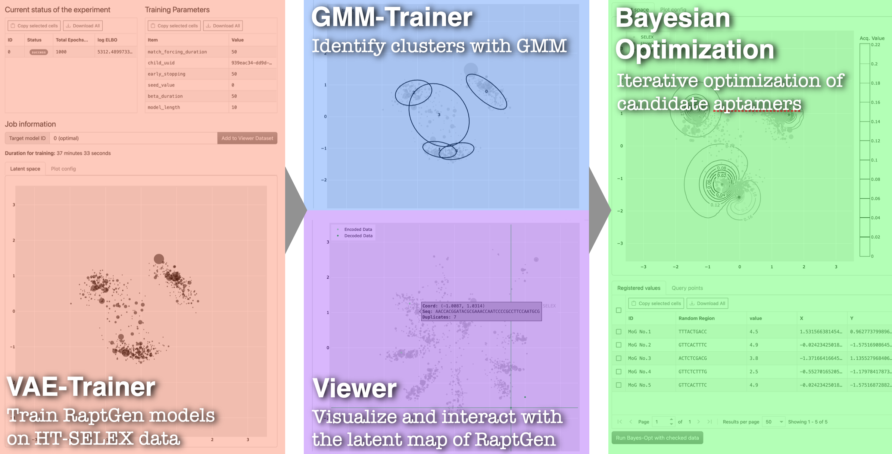

<div align="center">
   <br>
   The GUI for RaptGen developed with React and FastAPI
</div>

## What is RaptGen-UI?

RaptGen-UI is a web-based user-friendly interface for RaptGen, a powerful Latent Space Bayesian Optimization (LSBO) method for identifying and optimizing aptamers from high-throughput SELEX data. For more information about RaptGen, please refer to the [RaptGen paper](https://doi.org/10.1038/s43588-022-00249-6).

## Overview

<p align="center">
   <br>
</p>

Currently, RaptGen-UI supports four modules: Viewer, VAE Trainer, GMM Trainer, and Bayesian Optimization.
Users first need to upload their data and then run VAE Trainer module. After that, users can inquire the latent space of the uploaded data by Viewer module, or run GMM Trainer module to get clustering results. Finally, users can use Bayesian Optimization module to optimize aptamers.

For more information about its usage, please click the following links.

- [Viewer](docs/Viewer.md)
- [VAE Trainer](docs/VAE_Trainer.md)
- [GMM Trainer](docs/GMM_Trainer.md)
- [Bayesian Optimization](docs/BO.md)

## How to Launch

### Preliminaries

Please check if the Docker is installed. like

```shell
$ docker -v
Docker version 20.10.21, build baeda1f
```

### Procedure

1. Open your terminal. If you would like to run this application on a remote server, use SSH with port-forwarding.
   ```shell
   $ ssh -L 18042:localhost:18042 username@hostname.com
   ```
   Otherwise, skip this step.
2. Clone this repository wherever you want, then go into `RaptGen-UI` directory.
   ```shell
   $ git clone https://github.com/hmdlab/RaptGen-UI.git
   $ cd RaptGen-UI
   ```
3. Build and run containers with following docker-compose.
   ```shell
   $ docker compose up -d
   ```
   If you have GPU devices which supports CUDA, run with `docker-compose.gpu.yml` file instead.
   ```shell
   $ docker compose -f docker-compose.gpu.yml up -d
   ```
4. Please wait before all the containers are ready. This may take a few minutes. Even if Docker says they are ready, it may take some extra time for the `frontend` container to be working.
5. Access http://localhost:18042 with your favorite internet browser.
6. If you would like to stop the containers, please type the following command. This stops containers and all data will be retained in `db` container.
   ```shell
   $ docker compose stop
   ```

> [!WARNING]
> If you send `down` command, containers and database will be removed.
> If you want to keep the data, please make sure to use `stop` command.

## Built With

**Frontend**

- [![TypeScript][TypeScript]][TypeScript-url]
- [![Bootstrap][Bootstrap]][Bootstrap-url]
- [![Redux][Redux]][Redux-url]
- [![Plotly][Plotly]][Plotly-url]
- [![ReactDataGrid][ReactDataGrid]][ReactDataGrid-url]

**Backend**

- [![Python][Python]][Python-url]
- [![FastAPI][FastAPI]][FastAPI-url]
- [![PyTorch][PyTorch]][PyTorch-url]
- [![Celery][Celery]][Celery-url]

**Database**

- [![PostgreSQL][PostgreSQL]][PostgreSQL-url]
- [![Redis][Redis]][Redis-url]

**Deployment**

- [![Docker Compose][Docker Compose]][Docker Compose-url]

## License

This project is licensed under the [MIT License](LICENSE).

<!-- Links -->

[TypeScript]: https://img.shields.io/badge/Next.js-000000.svg?logo=next.js&style=flat&logoColor=white
[Bootstrap]: https://img.shields.io/badge/Bootstrap-7952B3.svg?logo=bootstrap&style=flat&logoColor=white
[Redux]: https://img.shields.io/badge/Redux-764ABC.svg?logo=redux&style=flat&logoColor=white
[Plotly]: https://img.shields.io/badge/Plotly.js-3F4F75.svg?logo=plotly&style=flat&logoColor=white
[ReactDataGrid]: https://img.shields.io/badge/ReactDataGrid-42B883.svg?logo=react&style=flat&logoColor=white
[Python]: https://img.shields.io/badge/Python-3776AB.svg?logo=python&style=flat&logoColor=white
[FastAPI]: https://img.shields.io/badge/FastAPI-009688.svg?logo=fastapi&style=flat&logoColor=white
[PyTorch]: https://img.shields.io/badge/PyTorch-EE4C2C.svg?logo=pytorch&style=flat&logoColor=white
[Celery]: https://img.shields.io/badge/Celery-37814A.svg?logo=celery&style=flat&logoColor=white
[PostgreSQL]: https://img.shields.io/badge/PostgreSQL-4169E1.svg?logo=postgresql&style=flat&logoColor=white
[Redis]: https://img.shields.io/badge/Redis-DC382D.svg?logo=redis&style=flat&logoColor=white
[Docker Compose]: https://img.shields.io/badge/Docker%20Compose-2496ED.svg?logo=docker&style=flat&logoColor=white
[TypeScript-url]: https://www.typescriptlang.org/
[Bootstrap-url]: https://getbootstrap.com/
[Redux-url]: https://redux.js.org/
[Plotly-url]: https://plotly.com/javascript/
[ReactDataGrid-url]: https://adazzle.github.io/react-data-grid/
[Python-url]: https://www.python.org/
[FastAPI-url]: https://fastapi.tiangolo.com/
[PyTorch-url]: https://pytorch.org/
[Celery-url]: https://docs.celeryq.dev/en/stable/
[PostgreSQL-url]: https://www.postgresql.org/
[Redis-url]: https://redis.io/
[Docker Compose-url]: https://docs.docker.com/compose/
