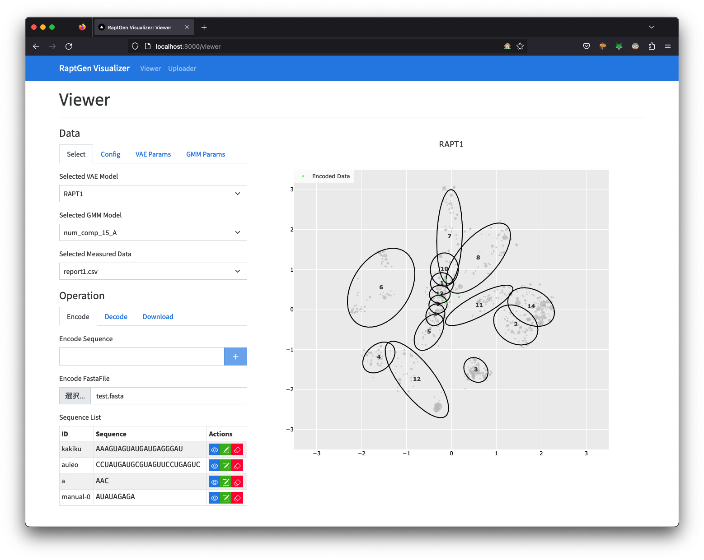
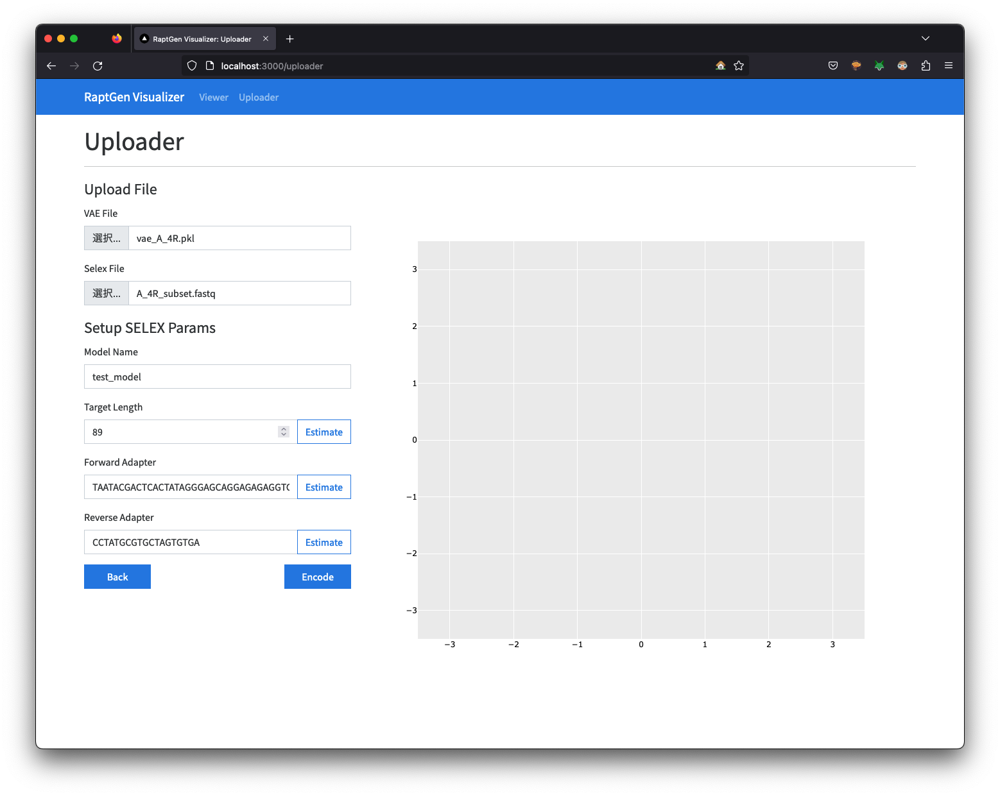

# RaptGen UI

The GUI for RaptGen developed with React and FastAPI.

## How to Launch

### Preliminaries

Please check if the Docker is installed. like

```shell
$ docker -v
Docker version 20.10.21, build baeda1f
```

### Procedure

1. Export your UID and GID environmental variables (needed for the `worker` container to work successfully)
   ```shell
   $ export UID GID
   ```
2. build and run containers with docker-compose. You need to assign the `docker-compose.prod.yml` file.
   ```shell
   $ docker-compose -f docker-compose.prod.yml up -d
   ```
3. Please wait before all the containers are ready. This may take minutes. Even if Docker says all the containers are ready, it may take some extra time for the `frontend` container to be working.
4. Access http://localhost:3000 with your favourite internet browser.

## Usage

For now, viewer and uploader have been implemented.

### Viewer

Visualize the latent map of the HT-SELEX data.

You can encode a single nucleotide sequence or batch sequences from fasta file. However decoding from a batch coordinates file is not supported.
Downloading is also supported. You can select which cluster to download.



### Uploader

Upload a RaptGen model to visualize.
**Under Construction**


