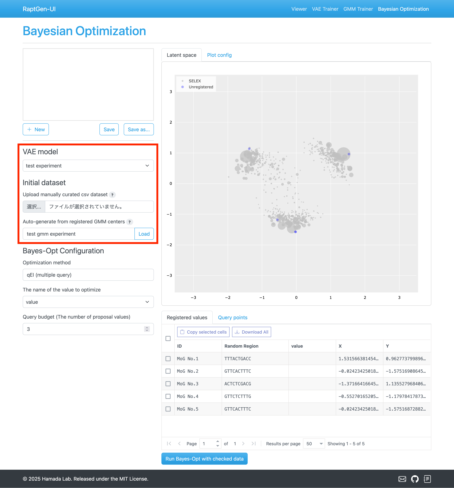

# Bayesian Optimization

Optimize the HT-SELEX data with Bayesian Optimization.

## Accessing the Bayesian Optimization Page

Navigate to the Bayesian Optimization by clicking the `Bayesian Optimization` link in the top menu or the navigation bar.

## Bayesian Optimization Process

The process involves the following steps:

1. Load initialization dataset.
2. Configure optimization parameters.
3. Measure target function (prepare sequence affinity data using methods like Surface Plasmon Resonance).
4. Run Bayesian Optimization to get new candidate sequences.
5. Repeat from step 3.

We will explain each step in detail in the following sections.

### Loading the initialization dataset

When you access the Bayesian Optimization page, the following view will be shown.
Please select the VAE model and initialization dataset.
The centroid of the Gaussian Mixture Model (GMM) is selected for this explanation, but you can also use manually selected sequences.

Options for initialization:

- Upload CSV dataset:
  - Columns must include
    - `random_regions`: RNA sequences.
    - `seq_id`: Sequence identifier.
  - Other columns are optional. You can use them for the target value to be optimized.
    - When multiple columns are there, you can select the target column name in the `Bayes-Opt Configuration` section.
- Select from registered GMM centers:
  - Choose a GMM model trained with the GMM Trainer.
  - Set target values manually.

### Configuring Bayesian Optimization

Set the following parameters:

- `Optimization method`:
  - Choose `qEI` for multiple query Expected Improvement.
- `The name of the value to optimize`:
  - Select the target column from the uploaded CSV.
  - If you selected the GMM centers for the initial optimization, the column name does not affect the optimization.
- `Query budget`:
  - Set the number of candidate sequences to be measured.

### Measuring the target function

Review the `Registered values` table showing sequences and their latent coordinates.
If using GMM centers, fill in target values in the `value` column.

Select entries for optimization by checking the boxes on the left side of the table.

### Running the Optimization

After setting the optimization parameters, click the `Run Bayes-Opt with checked data` button.
Results appear in the `Latent Space` and `Query points by Bayesian Optimization` sections.

The `Latent Space` section shows coordinates of queried sequences as green dots, and the acquisition function as the contour.

Select candidate sequences from the `Query points` table, and click the `Add to the registered values table` button for the next optimization round.

## Saving the session

For parallel processing, you can save and load optimization sessions:

- Save: Click `Save` or `Save as...` and enter a session name.
- Load: Select a saved session from the list at the top left of the page.
