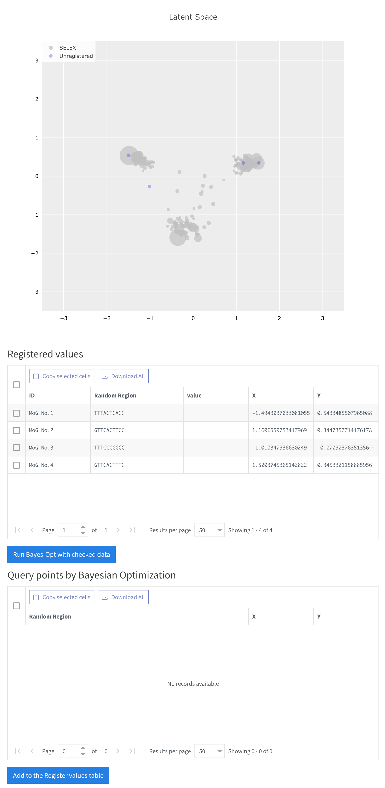
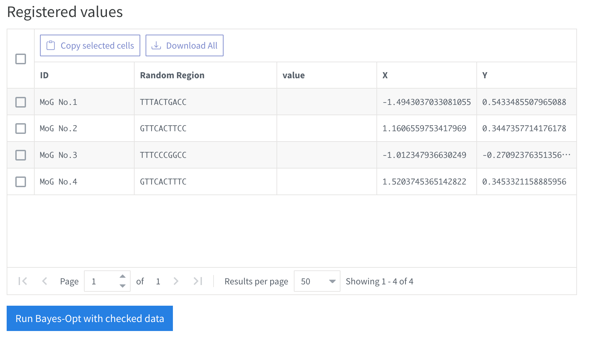
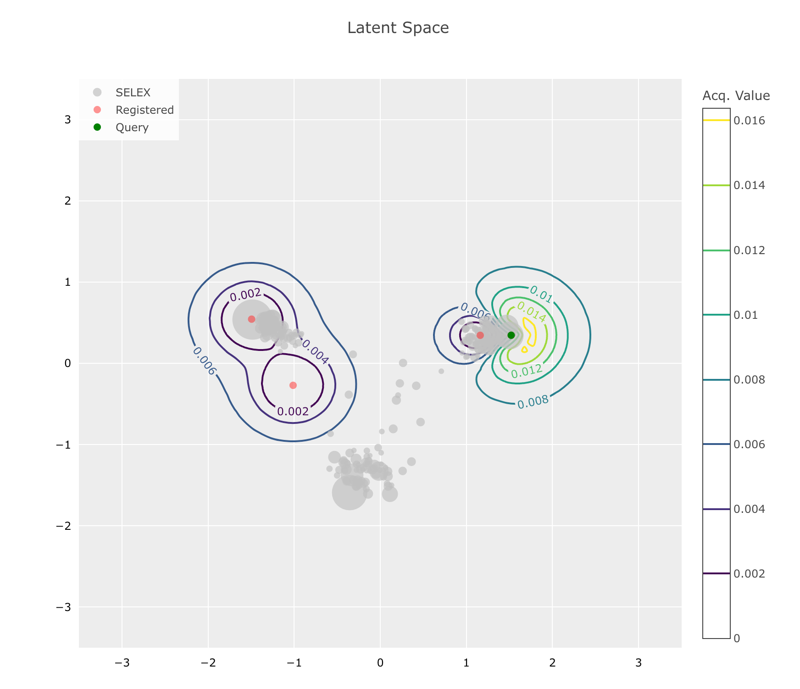
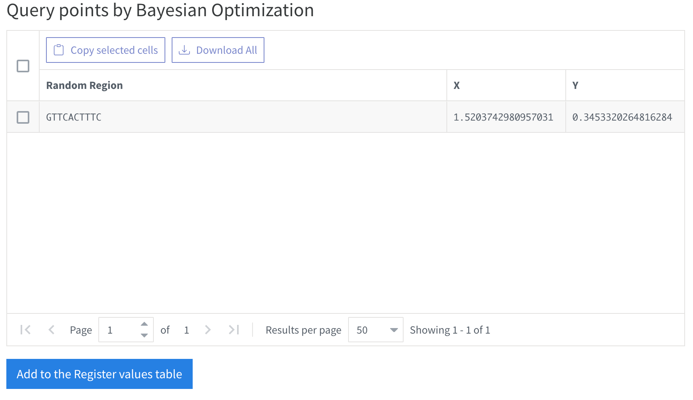

# Bayesian Optimization

Optimize the HT-SELEX data with Bayesian Optimization.

## Bayesian Optimization View

## How to Optimize

To run the Bayesian Optimization, target data is required. Since the Bayesian Optimization is a black-box optimization, the target data should be the measurement of the target function. In this case, the target data is the affinity of the sequences. 

Broadly, the Bayesian Optimization is runned in the following steps:

1. Measure the target function.
   1. Measure the affinity of the sequences. You will need to prepare the sequence <> affinity data.
2. set the optimization parameters.
   1. Set the optimization parameters. You can set the optimization parameters left side of the view. See [Optimization Parameters](#optimization-parameters) for more details.

### Optimization Parameters

#### VAE model

- Select Pane:
  - `Selected VAE model`: The VAE model for the optimization. You can select the VAE model from the list.
- Config Pane:
  - `Minimum Count`: The minimum count to show data on the lataent map.

#### Initial Dataset

- upload csv dataset:
  - the csv dataset for the initial dataset. The csv dataset should have the following columns with header:
    - `random_regions`: The sequence of the DNA.
    - `seq_id`: The affinity of the sequence.
    - `target`: The target value of the sequence. This is the value to be optimized.
      - the column name is not fixed. You can set the target column name on the `Bayes-Opt Configuration` component. 
- or get from registered GMM centers:
  - The GMM centers from the GMM model. You can select the GMM model from the list. The GMM models can be trained with the [GMM Trainer](GMM_Trainer.md).
  - If you select the GMM centers, set the target value of the sequences manually.

#### Bayes-Opt Configuration

- `Optimization method`: 
  - The optimization method. You can choose `qEI` for multiple query Expected Improvement.
- `The name of the value to optimize`: 
  - Select the column of the uploaded csv. This is the column name of the target value in the csv dataset. If you select the GMM centers for initial optimization, this column name do not affect the optimization.
- `Query budget`: 
  - The number of queries for the optimization. The optimization will be stopped after the number of queries.

### Iterative Optimization

After setting the optimization parameters, see the right side of the view. 

The "Registered values" component shows the imported dataset. 

#### Running the Optimization with registered data

To run the optimization, first, select the sequences to optimize. You can select the sequences by clicking the checkbox on the left side of the view.

After selecting the sequences, click the `Run Bayes-Opt with checked data` button. The optimization will be started and the result will be shown on the `Latent Space` component and `Query points by Bayesian Optimization` component.

#### Optimization Result

The following components will be shown after the optimization.

- `Latent Space`: The latent space of the sequences. The sequences are colored by the target value. The contour shows the acquisition function of the Bayesian Optimization.

- `Query points by Bayesian Optimization`: The query points by the Bayesian Optimization. The query points are shown on the latent space. To add the query points for next optimization, click the `Add to the registered values table` button.
