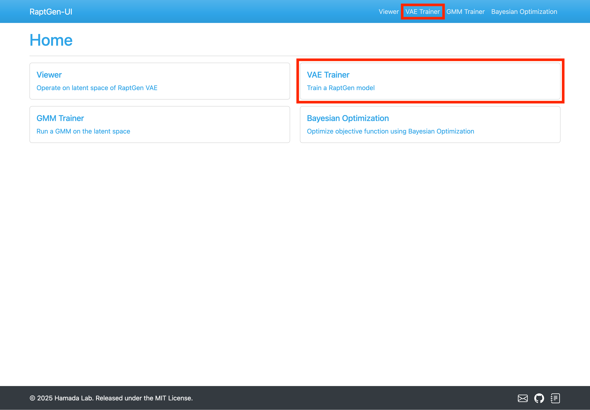
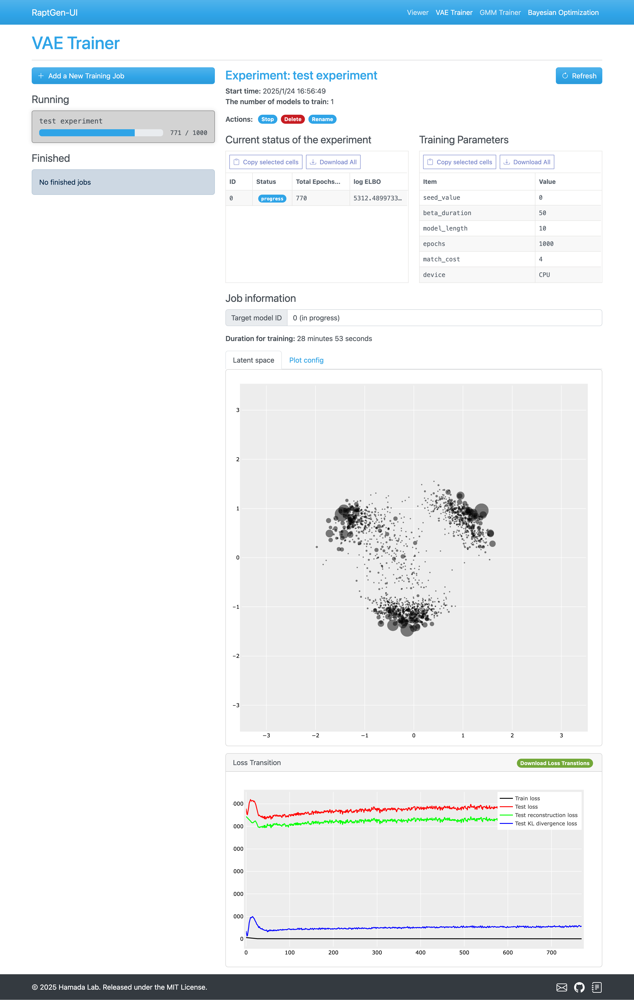
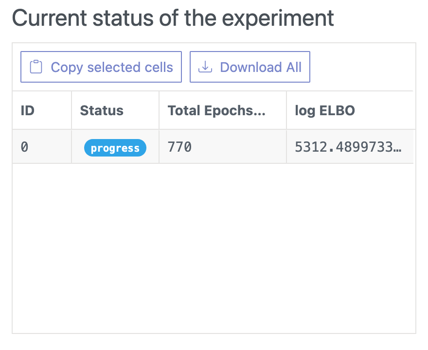
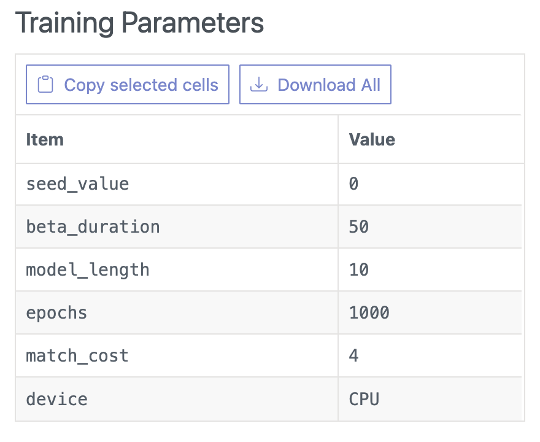

# VAE Trainer

This page allows you to train a VAE model using HT-SELEX data.

## Accessing the VAE Trainer Page

Navigate to the VAE Trainer by clicking the `VAE Trainer` link in the top menu or the navigation bar.

## Training Process

### Initiating a New Training Job

Click the `+ Add a New Training Job` button located at the top left of the page.

### Setting the parameters

Set the preprocessing parameters for your training job, then click the `Next` button.

**Preprocessing Parameters**

- ① Model Type:
  - The type of the model. Choose `RaptGen`.
- ② Experiment Name:
  - Assign a name to your experiment.
- ③ Target Length:
  - Specify the sequence length, including adapter length. The estimate button activates after loading SELEX sequences (⑦).
- ④ Adapters:
  - Set sequence adapters (constant region at 3' or 5' end). The `Estimate` button becomes available after setting the `Target Length` parameter (③).
- ⑤ Filtering Tolernace:
  - Set the tolerance for sequence filtering, which is the allowable difference between the target length and the length of the sequence.
- ⑥ Minimum Count:
  - Define the minimum sequence count. Sequences below this threshold will be filtered out.
- ⑦ SELEX sequences:
  - Upload your training sequences in `.fasta` or `.fastq` format.

Next, set the training parameters and click the `Train` button.

**Training Parameters**

- ① Reiteration of Training:
  - Specify how many times to repeat training with the same dataset. (Not epoch, but the number of training)
- ② Device:
  - Select `CPU` or `cuda:X` for GPU (if available).
- ③ Seed Value:
  - Set a seed for reproducibility. `Generate Random Seed` button in the right will generate a random seed.
- ④ Maximum Number of Epochs:
  - Set the maximum training epochs
- ⑤ Early Stopping Patience:
  - Define how many epochs without improvement of the validation loss before stopping the training.
- ⑥ Beta Weighting Epochs:
  - Specify epochs for increasing beta value from 0 to 1.
- ⑦ Force Matching Epochs:
  - Specify epochs for force-matching. During the force-matching phase, the profile HMM model will be forced to have less penalty on match-to-match state transition score.
- ⑧ Match Cost:
  - Define the intensity of the force-matching. The larger value will force the profile HMM model to have less penalty match-to-match state transition score.
- ⑨ pHMM model length:
  - Set the profile HMM model length. Default is random region length.

### Training the model

After submission, the job appears in the Running Jobs list. You can monitor progress, stop, delete, or rename jobs from this list.

- To stop, delete or rename the job, you can click the `Stop`, `Delete`, or `Rename` button, respectively.
- The current status of the experiment section shows the job's progress and total number of jobs.
  
- The Training Parameters section displays the job's training parameters.  
  
- The Job information section provides details about the training job.  
  

### Adding the Trained Model to the Model List

Once training completes, add the model to the model list by clicking `Add to Viewer Dataset` button.

Name your model in the pop-up modal and click the `Add to Viewer Dataset` button.

The trained model will then be available in the Viewer, GMM Trainer and Bayes Optimization pages.

## Next Step

Proceed to the [GMM Trainer](GMM_Trainer.md) page to train a GMM model.

If you have already trained a GMM model or have a initializing dataset in BO module, you can proceed to the [Bayesian Optimization](BO.md) page.
