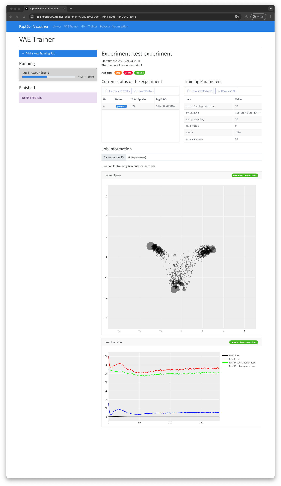
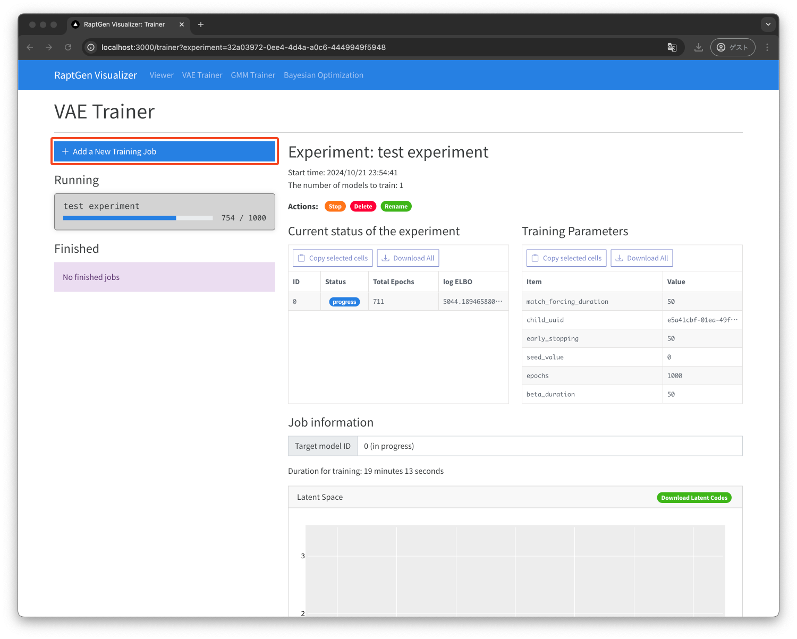
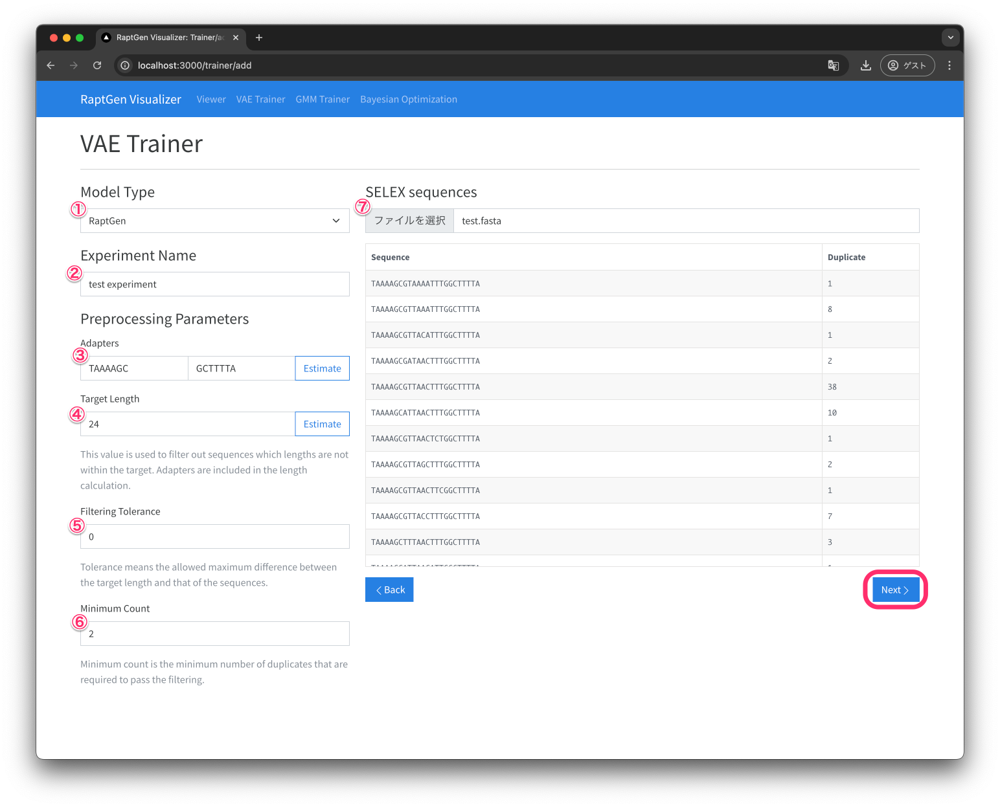
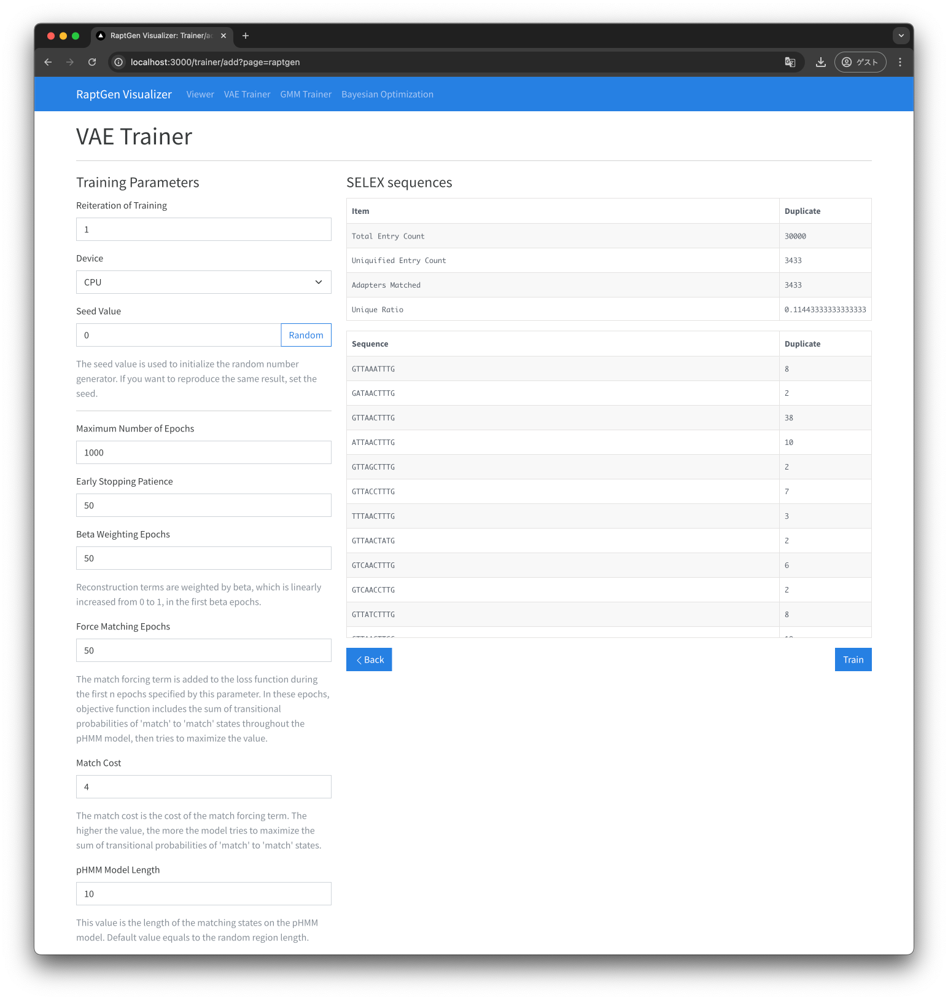
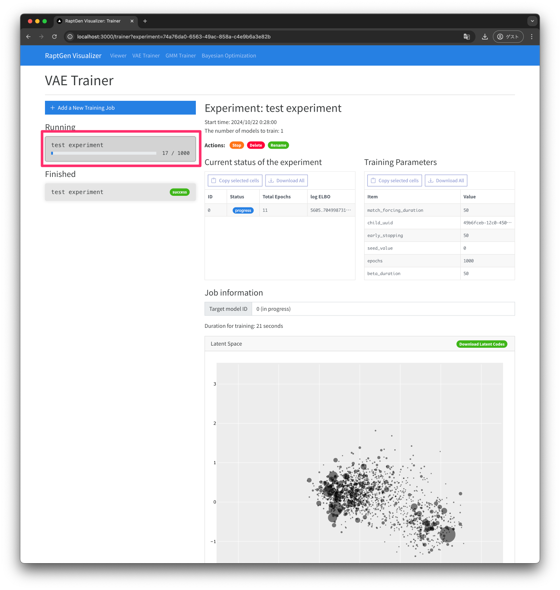

# VAE Trainer

In this page, you can train a VAE model with the HT-SELEX data.

The following screenshot show the view of the VAE Trainer.

## How to Train

1. Click the `+ Add a New Tranining Job` button.
   
2. Set the preprocessing parameters for the training job. After setting the parameters, click the `Next` button.
   
   1. Model Type: The type of the model. You can choose `RaptGen`.
   2. Experiment Name: The name of the experiment.
   3. Preprocessing Parameters:
      1. Adapters: The adapters for the sequences. You can run `Estimate` after setting the `Target Length` parameter.
      2. Target Length : The target length of the sequences. This includes the adapter length.
   4. Filtering Tolernace: The tolerance for filtering the sequences.
   5. Minimum Count: The minimum count of the sequences. The sequences with the count less than this value will be filtered.
   6. SELEX sequences: The SELEX sequences for training. `.fasta` file and `.fastq` file are supported.
3. Set the training parameters for the training job. After setting the parameters, click the `Train` button.
   
   1. Reiteration of Training: The number of reiteration of the training. The training will be repeated with the same dataset for the number of times.
   2. Device: The device for the training. You can choose `CPU` or `cuda:X` for GPU(if available).
   3. Seed Value: The seed value for the random number generator. If you want to reproduce the training, you can set the seed value. If you want to train the model with the different seed value, you can set the seed value to `-1`.
   4. Maximum Number of Epochs: The maximum number of epochs for the training.
   5. Early Stopping Patience: The patience for early stopping. If the validation loss does not decrease for the number of epochs, the training will be stopped.
   6. Beta Weighting Epochs: The number of epochs for the beta weighting. The beta value will be increased from 0 to 1 for the number of epochs.
   7. Force Matching Epochs: The number of epochs for the force matching. The force matching will be applied for the number of epochs. In the force matching term, the profile HMM model will be force to have less penalty match-to-match state transition score.
   8. Match Cost: The match cost for the force matching. The match cost is the penalty for the match-to-match state transition score. The larger value will force the profile HMM model to have less penalty match-to-match state transition score.
   9. pHMM model length: The length of the profile HMM model. The profile HMM model will be trained with the length of the pHMM model. Default value equals to the random region length.
4.  Training job is submitted. You can select the running training job from the list.
    