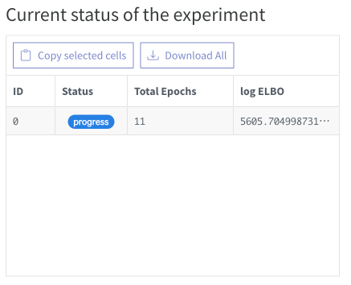
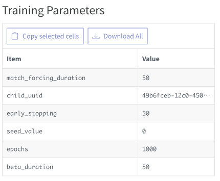
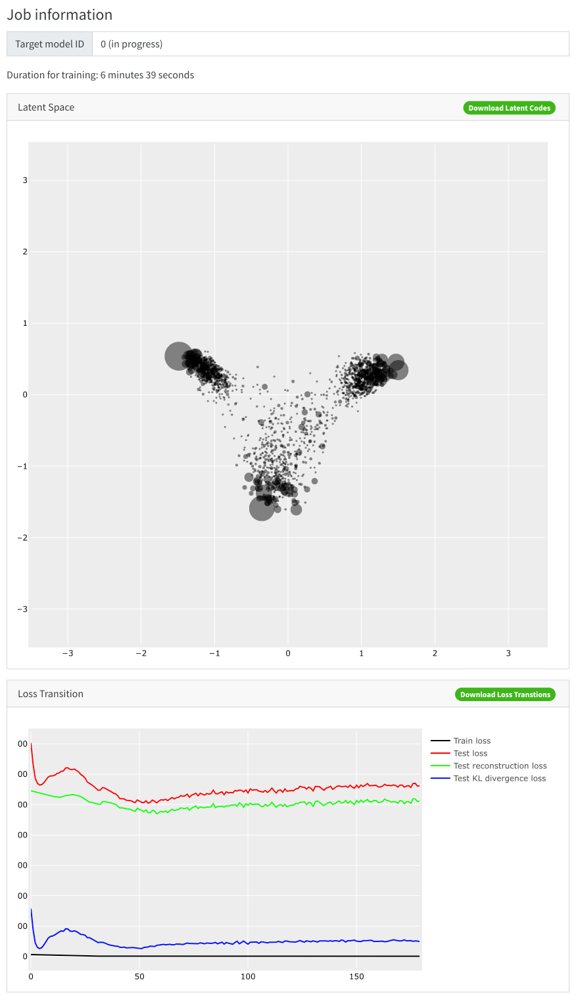
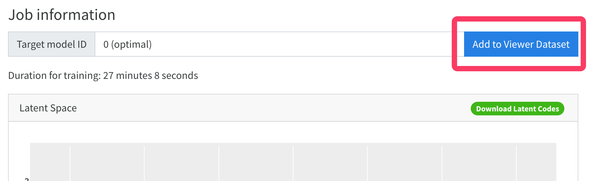
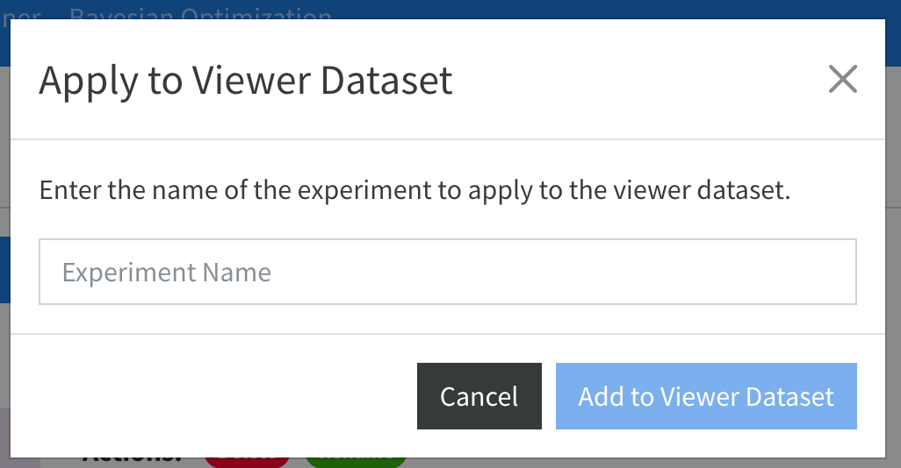

# VAE Trainer

In this page, you can train a VAE model with the HT-SELEX data.

## VAE Trainer View

The following screenshot show the view of the VAE Trainer.

## How to Train

### Adding a new training job

Click the `+ Add a New Tranining Job` button.

### Setting the parameters
Set the preprocessing parameters for the training job. After setting the parameters, click the `Next` button.

**Preprocessing Parameters**

- ① Model Type: 
	- The type of the model. You can choose `RaptGen`.
- ② Experiment Name: 
	- The name of the experiment.
- ③ Preprocessing Parameters - Adapters:
	- The adapters for the sequences. You can run `Estimate` after setting the `Target Length` parameter. Note that the Estimate button will be enabled after setting the `Target Length` parameter (④).
- ④ Preprocessing Prameters - Target Length : 
	- The target length of the sequences. This includes the adapter length. Note that the estimate button will be enabled after loading SELEX sequences (⑦).
- ⑤ Filtering Tolernace: 
	- The tolerance for filtering the sequences.
- ⑥ Minimum Count: 
	- The minimum count of the sequences. The sequences with the count less than this value will be filtered.
- ⑦ SELEX sequences: 
	- The SELEX sequences for training. `.fasta` file and `.fastq` file are supported.

On the training parametersview, set the training parameters for the training job. After setting the parameters, click the `Train` button.

**Training Parameters**

- ① Reiteration of Training: 
	- The number of reiteration of the training. The training will be repeated with the same dataset for the number of times.
- ② Device: 
	- The device for the training. You can choose `CPU` or `cuda:X` for GPU(if available).
- ③ Seed Value: 
	- The seed value for the random number generator. If you want to reproduce the training, you can set the seed value. If you want to train the model with the different seed value, you can set the seed value to `-1`.
- ④ Maximum Number of Epochs: 
	- The maximum number of epochs for the training.
- ⑤ Early Stopping Patience: 
	- The patience for early stopping. If the validation loss does not decrease for the number of epochs, the training will be stopped.
- ⑥ Beta Weighting Epochs: 
	- The number of epochs for the beta weighting. The beta value will be increased from 0 to 1 for the number of epochs.
- ⑦ Force Matching Epochs: 
	- The number of epochs for the force matching. The force matching will be applied for the number of epochs. In the force matching term, the profile HMM model will be force to have less penalty match-to-match state transition score.
- ⑧ Match Cost: 
	- The match cost for the force matching. The match cost is the penalty for the match-to-match state transition score. The larger value will force the profile HMM model to have less penalty match-to-match state transition score.
- ⑨ pHMM model length: 
	- The length of the profile HMM model. The profile HMM model will be trained with the length of the pHMM model. Default value equals to the random region length.

### Training the model

Training job is submitted and added to the Running Jobs list. You can check the training progress in the Running Jobs list.

- To Stop, Delete or Rename the training job, you can click the `Stop`, `Delete`, or `Rename` button.
- The current status of the experiment section shows the running status of the training job. The total number of jobs are the number of `reiteration of training` parameter.  
	
- The Training Parameters section shows the training parameters for the training job.  
	
- The Job information section shows the job information for the training job.  
	

### Add the trained model to the Model List
After the training is finished, Add the trained model to the Model List by clicking the `Add to Viewer Dataset` button.

Type the name to add the trained model to the Model List.

## Next Step

- [Train GMM](GMM_Trainer.md)