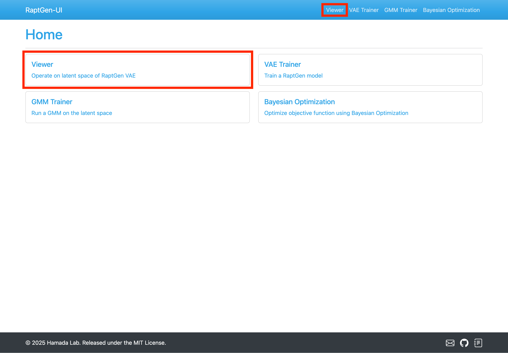
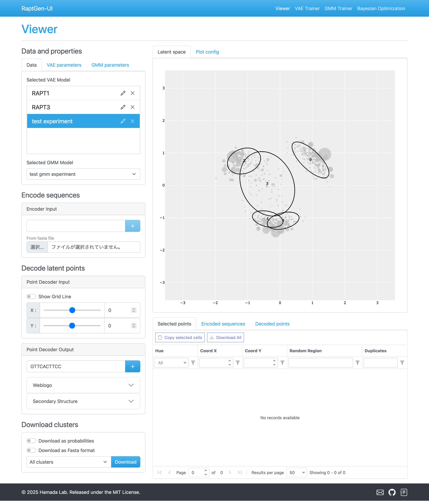
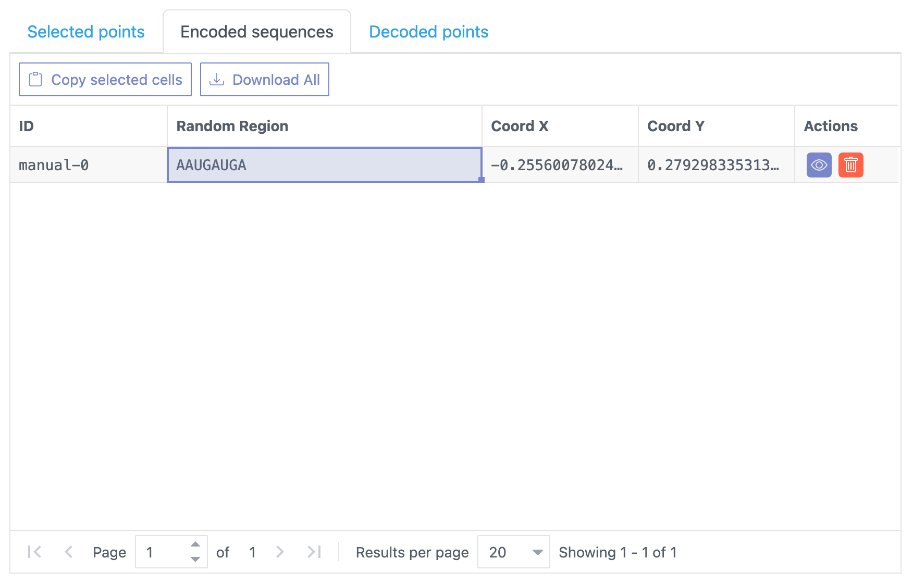
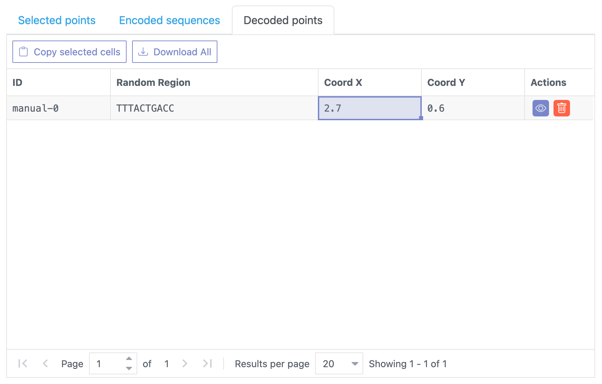
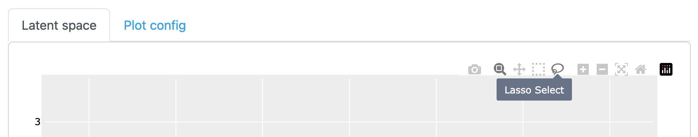

# Viewer

Interactive viewer for the trained model.

## Accessing the Viewer Page

Navigate to the Viewer by clicking the `Viewer` link in the top menu or the navigation bar.

## Features

The Viewer page offers four main functionalities.

- Encoding sequences into latent space
- Decoding points from latent space into sequences
- Downloading sequences.
- Interactive selection of points in latent space

Let's explore each feature in detail.

## Encoding sequences

You can encode sequences in two ways.

- Enter the sequence directly into the provided form.
- Upload a file in `.fasta` format.

After entering a sequence in the form, click the `+` button to encode and add it to the table.
The results appear in the `Encoded sequences` table below the latent plot.

In the `Encoded sequences` table, you have option to:

- Modify sequences: Double-click the cell in the `Random Region` column.
- Delete sequences: Click the trash icon.
- Toggle visibility in latent plot: Click the eye icon.

> [!WARNING]
> Each sequence must consist of `A`, `C`, `G`, `T`, or `U`. The ambiguous base `N` is not permitted.

## Decoding points in latent space

The decoding module consists of two panels:

- Input panel: Select x and y coordinates of the points in the latent space.
- Output panel: View the decoded sequence and associated information.

The input panel includes a toggle for grid line visibility, helping you pinpoint exact coordinates in the latent space.

In the output panel, you will see the decoded sequence and a `+` button in the right. Clicking this button adds the sequence to the `Decoded points` table.

The `Decoded points` table allows you to:

- Modify coordinates: Double-click the respective cell in the `x` and `y` columns.
- Delete sequences: Click the trash icon.
- Toggle visibility in latent plot: Click the eye icon.

Additional features in the output panel:

- `Weblogo` toggle: Displays the weblogo at the specified coordinate, calculated from the pHMM decoder's raw output values. The x-axis represents sequence position, while the y-axis shows the score (log probability) of the base at each position.
- `Secondary structure` toggle: Reveals the secondary structure of the decoded sequence, including 3'' and 5' flanking constant regions.

## Downloading clusters

To download sequences from a specific cluster:

1. Select the desired cluster from the dropdown menu.
2. Click the `Download` button.

Download options:

- Toggle `Download as Fasta format`: Downloads the sequences in `.fasta` format.
- Toggle `Download as probabilities`: Downloads the sequences and the probabilities in `.csv` format.

## Interactively selecting points in latent space

This feature utilizes the [plotly.js](https://plotly.com/javascript/) library for an interactive experience.

To select points:

1. Choose either the `Box Select` or `Lasso Select` button to change the selection mode.
   
2. Click and drag your mouse to select points in the latent space. Unselected points are shown in gray, helping you focus on your selection.
   
   Selected points are shown in `Selected points` table. You can save the selected points by clicking the `Download All` button in the table.
