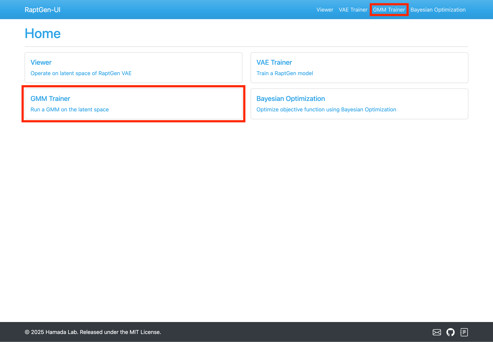
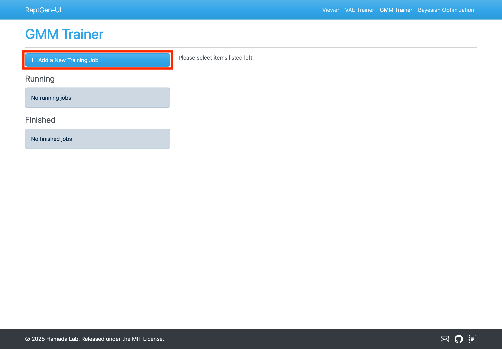
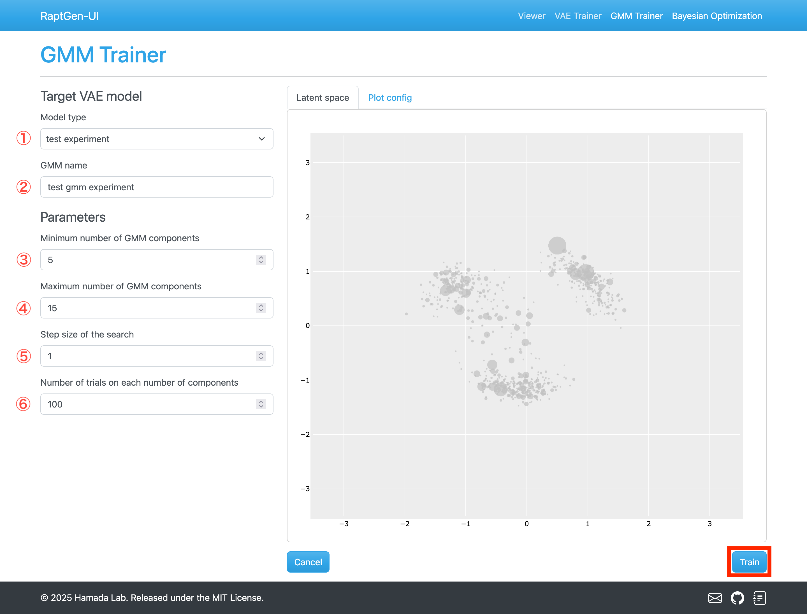
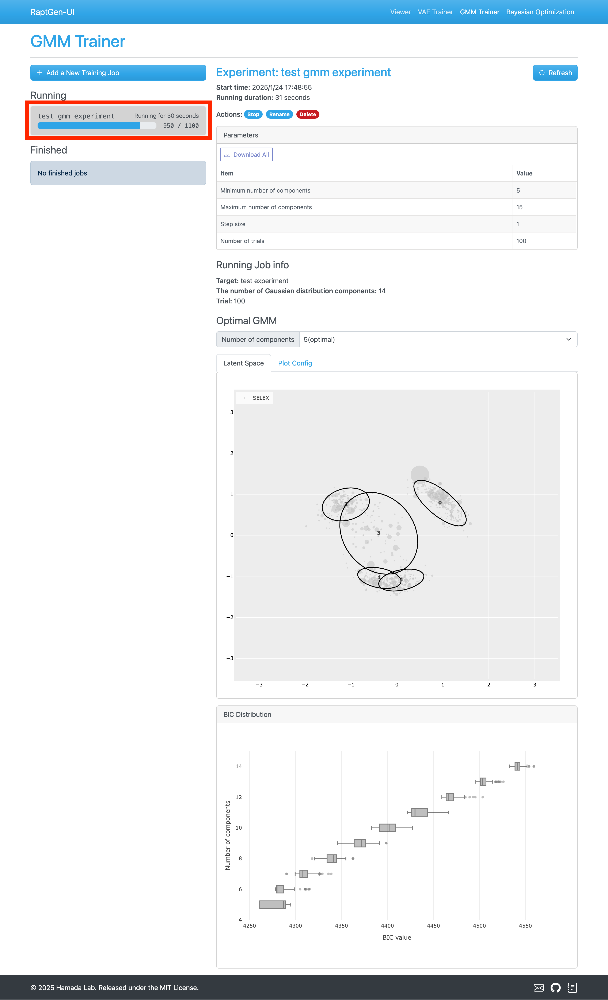
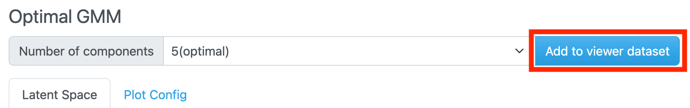
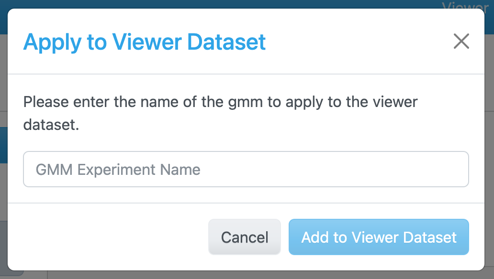

# GMM Trainer

In this page, you can train a GMM on the encoded HT-SELEX data.

## Accessing the GMM Trainer

Navigate to the GMM Trainer by clicking the `GMM Trainer` link in the top menu or the navigation bar.

## Training Process

### Initiating a new training job

Begin by clicking the `+ Add a New Training Job` button.

### Configuring Parameters

Set the preprocessing parameters for your training job, then click the `Next` button.

**Parameters**

1. **Model Type**: Select the VAE model registered in the database.
2. **GMM name**: Assign a name to your GMM model.
3. **Minimum number of GMM components**: Set the lower limit for GMM components.
4. **Maximum number of GMM components**: Set the upper limit for GMM components.
5. **Step size of the search**: Define the increment for searching GMM components.
6. **Number of trials on each number of components**: Specify the number of iterations for each number of GMM commponents.

The GMM training is runned multiple times to select the best BIC model among the models trained with the different number of GMM components. The number of the training is determined by the following formula:

$$
\text{Number of trials} = \text{Number of trials on each number of components} \times (\text{Maximum number of components} - \text{Minimum number of components} + 1)
$$

More trials increase accuracy, but it takes longer to train.

### Training the GMM model

After submission, the training begins, and progress is displayed in the `Running` job list.

### Add the model to the Model List

Once training completes, the `Add to Viewer Dataset` button becomes active. Click it to add the model to the dataset.
By default, the best number of components is selected based on the BIC score. You can change this using the dropdown menu.

When you click the button, the following dialog will be shown.
Fill in the name of the model and click the `Add to Viewer Dataset` button.

## Next Step

Proceed to the [Bayesian Optimization](bayesian-optimization.md) page to optimize aptamer sequence on latent space.
