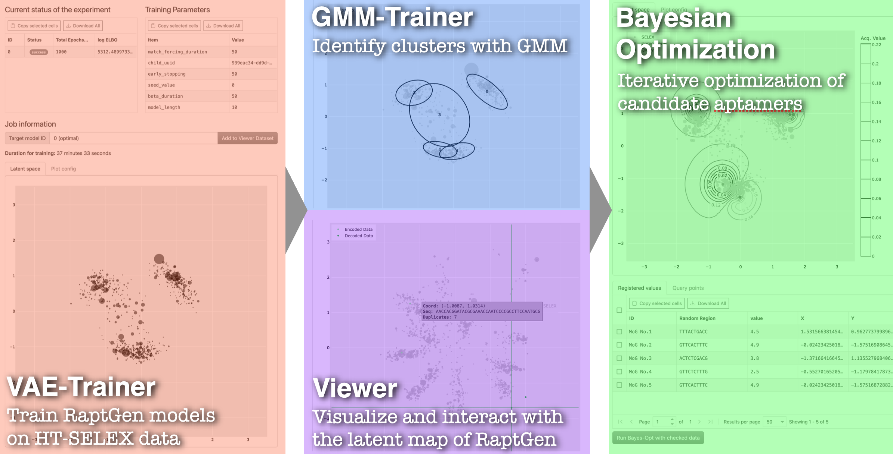

# Welcome to RaptGen-UI

RaptGen-UI is a web-based user-friendly interface for RaptGen, a powerful Latent Space Bayesian Optimization (LSBO) method for identifying and optimizing aptamers from high-throughput SELEX data. For more information about RaptGen, please refer to the [RaptGen paper](https://doi.org/10.1038/s43588-022-00249-6).

## Overview

Currently, RaptGen-UI supports four modules: Viewer, VAE Trainer, GMM Trainer, and Bayesian Optimization.
Users first need to upload their data and then run VAE Trainer module. After that, users can inquire the latent space of the uploaded data by Viewer module, or run GMM Trainer module to get clustering results. Finally, users can use Bayesian Optimization module to optimize aptamers.
